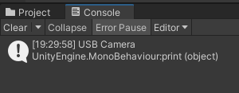
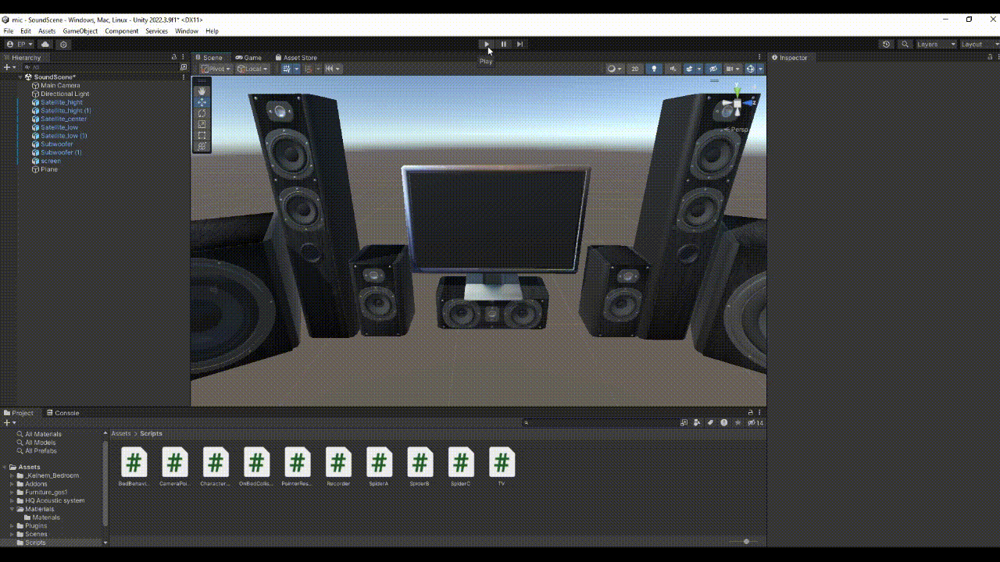
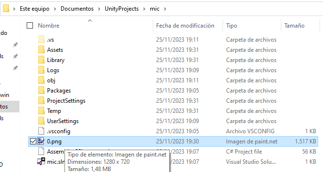

# Interfaces Inteligentes - Práctica Cámara y Micrófono en Unity
### Se devuelve el nombre de la cámara por consola

### La cámara sustituye la textura de un objeto de manera que se renderiza en la escena

### Con "s", "p" y "x" se inicia la cámara, se pausa y se saca una imagen que se guarda en el sistema local


### El código de la clase recorder consigue grabar y devolver por los altavoces el sonido grabado

```c#
using System.Collections;
using System.Collections.Generic;
using UnityEngine;

public class Recorder : MonoBehaviour
{
    public List<AudioSource> speakers;
    private AudioClip recorded;
    // Start is called before the first frame update
    void Start()
    {
        recorded = Microphone.Start(null, true, 3, 44100);
    }

    // Update is called once per frame
    void Update()
    {
        if (Input.GetKeyDown(KeyCode.R))
        {
            foreach (AudioSource speaker in speakers)
            {
                speaker.clip = recorded;
                speaker.Play();
            }
        }
        if (Input.GetKeyDown(KeyCode.T))
        {
            print("Finished recording");
            Microphone.End(null);
        }
    }
}
```

### En la escena del zombie, el zombie devuelve el sonido pedido con la siguiente adición al script de movimiento del zombie

```c#
private void OnCollisionEnter(Collision collision)
    {
        if (collision.collider.tag == "Spider")
        {
            print(contador);
            contador += 10;
            sonido.Play(0);
        }
    }
```